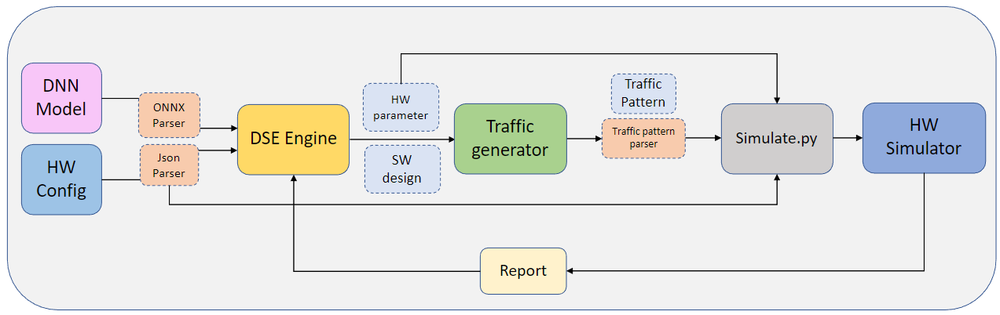

# Design Space Exploration for Scalable DNN Accelerators 

## System architecture


## Code structure
```
Lab447-Simulator/
├── DSE               -> All about DSE, design space
├── files             -> All files
├── gem5              -> gem5 src code
├── mem               -> Memory management script
├── onnx_parser       -> ONNX parser
├── report_parser     -> Gem5 report parser
└── traffic_generator -> Traffic generator src code
```

### Run Simulation
**All of the commands should be executed under the root directory of this repo**

## Docker Setup
- We provide docker environment setup, to create a simulation working environment, follow the following commands
  - `cd docker-user`
  - `bash run-docker.sh`
- To remove the docker container or docker image, under `docker-user` folder
  - Remove container only: `bash remove-docker.sh`
  - Remove both image and container: `bash remove-docker.sh 1`


### DSE
Include DSE Algorithms, design space generation, HW/SW parser, and MAESTRO wrapper
```
DSE/
├── maestro/           -> MAESTRO repor
├── parser/            -> HW/SW parser
├── algo_prototype.py  -> An interface for DSE algorithms
├── design_space.py    -> HW/SW Design space interface
├── downstreamAPI.py   -> The API to call the downstream process (traffic generator, gem5 simulator)
├── GA.py              -> SOGA
├── MOGA.py            -> MOGA
├── MOBO.py            -> MOBO
├── maestro_wrapper.py -> The API to call the MAESTRO evaluation
└── main.py            -> Framework entrypoint

```

### files
We use file for the communication of each component.

`DSE_hw.json` and `traffic_pattern.json` are required for gem5 to work.
```
files/
├── DSE               -> The output of SW DSE
├── DSE_HW            -> The output of HW DSE, DSE_hw.json is the input of gem5 hardware config
├── HW_config         -> The input of DSE Engine, include fixed hardware architecture or search hardware architecture
├── Traffic_Pattern   -> The output of Traffic Generator, traffic_pattern.json is the input of gem5 config
└── Report            -> The output of gem5 simulator
```

### Traffic Generator
```
traffic_generator/
├── Makefile               -> makefile
├── parser/                -> parse model json to cpp 
├── top.cpp                -> main function
├── traffic_generator/     -> generate traffic patterns
└── workload_analysis/     -> do model splitting & workload analysis
```


### How to build and run gem5
[gem5 README.md](gem5/README.md)

### How to build and run traffic generator
* Build
```
cd traffic_generator && make
```
* Run
```
./traffic_generator/top files/DSE/XXX 
```

The input of traffic generator is a valid design point which generated by DSE. We provide the example of design point in `Lab447-Simulator/files/DSE/tang_expe`

### How to run DSE Engine
* Example - VGG16 SW DSE on vanilla architecture, search with `ShiDianNao-like`
```
python3 DSE/main.py --sw onnx_parser/json/fuse/vgg16_fuse.json --arch files/HW_config/gem5_fixed_vanilla.json --cost_model gem5 --output lipper_expe/expe3 --dataflow shi --metrics both --optimize SW
```
```
usage: main.py [-h] --sw SW --arch ARCH [--optimize OPTIMIZE] [--hw_algo HW_ALGO] [--sw_algo SW_ALGO] [--cost_model COST_MODEL] [--metrics METRICS] [--output OUTPUT]
               [--dataflow DATAFLOW]

optional arguments:
  -h, --help            show this help message and exit
  --sw SW               Given an ONNX model
  --arch ARCH           Given HW config
  --optimize OPTIMIZE   SW / HW / CO
  --hw_algo HW_ALGO     BO / GA
  --sw_algo SW_ALGO     GA
  --cost_model COST_MODEL
                        maestro / gem5
  --metrics METRICS     latency / power / both
  --output OUTPUT       output file path
  --dataflow DATAFLOW   nvdla / shi / random
  ```
  * Notice 
    * If you only want to do SW DSE, `--arch` should be a fixed hardware architecture. `files/HW_config/gem5_fixed_vanilla.json` is an example of fixed config.
    * If you want to do Co-design or HW DSE, you need to specify a configurable config. `files/HW_config/gem5_search_vanilla.json` is an example of configurable config.
    
### Run MAESTRO 
* clone maestro repo
```
cd DSE && git clone https://github.com/maestro-project/maestro && cd maestro && scons
```


## Limitation
- Our work is capable of adapting deep learning (DL) models with the following operators:
  - Average Pooling
  - Batch Normalization
  - Convolution
  - ReLU (Rectified Linear Unit)
  - General Matrix Multiply (GEMM)

- Our work supports static shape models but cannot accommodate models with dynamic inference shapes (e.g., decoder-only models).

- The hardware architecture, including customized actions, should be implemented using `gem5`.
  - For example, we extend the vanilla design to support broadcasting functionality by modifying the cache request and response mechanism.